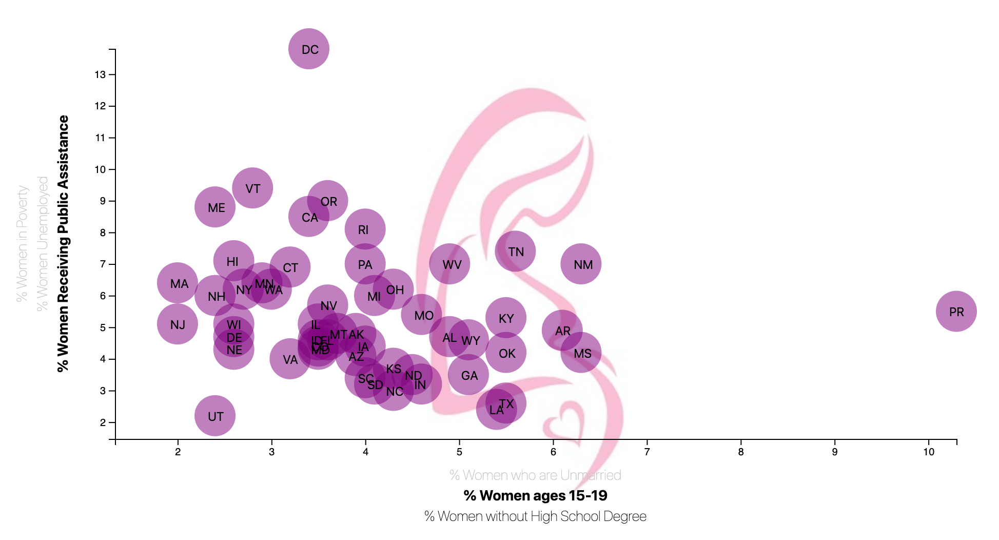
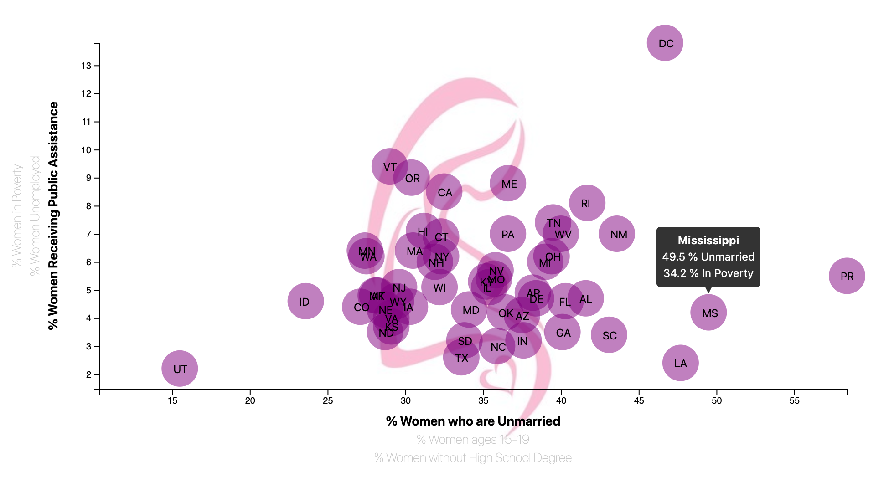

# Maternal Demographics in D3

The purpose of this project is create an interactive visual representation of demographic data using javascript d3 library. The data I used was gathered from the United States Census quantifying various demographics of women who have possibly given birth in the United States.

## Table of contents

* [Technologies](#technologies)
* [Development Process](#development-process)
* [Observations](#observations)
* [Contact](#contact)

## Technologies

* Javascript:
  * d3 - version 5.5
* HTML
  * Boostrap - version 4.3.1
* CSS
  * Used css from [Bootswatch v4.3.1](https://bootswatch.com)

## Development Process

I downloaded data as a csv from [U.S. Census Bureau and the Behavioral Risk Factor Surveillance System](https://factfinder.census.gov/faces/tableservices/jsf/pages/productview.xhtml?pid=ACS_17_5YR_S1301&prodType=table). The population consists of women between the ages of 15-50 who have given birth in the past year, based on 2017 ACS 5-year estimates from the U.S. Census Bureau and the Behavioral Risk Factor Surveillance System. The numbers reported are estimates of the % of distribution for each demographic.

Using d3, I created a scatter plot where each circle represented a state. That circle's x value represented one demographic and the y value represented another.

There are three demographic values that can be chosen by clicking on the different names on the X and Y axes. Both axes are scaled according to the selected datasets. Additionally, there is tooltip functionality that displays exact values for each datapoint.

Creating a scatter plot in this manner allows a visual examination of possible correlations between the selected demographics of women who have recently given birth.

## Observations

Based on the visual representations of these data, I was able to observe a few possible correlations.

There appears to be a correlation between poverty and women without a high school degree within this population. Puerto Rico appears to be an outlier here in that there is a high level of poverty in this demographic, but an average level of women without a high school degree.

There also appears to be a correlation between being unmarried and being in poverty in this demographic. In this case, Puerto Rico has both the highest rate of unemployment and the highest rate of unmarried women in the United States, whereas Utah has the smallest rate of both.

Another observation is that there is a correlation between being a teenager and experiencing poverty within this demographic. Again, Puerto Rico has a very high percentage of both as compared to the rest of the United States.

## Contact

Created by [Gretel Uptegrove](https://gretelup.github.io/)
